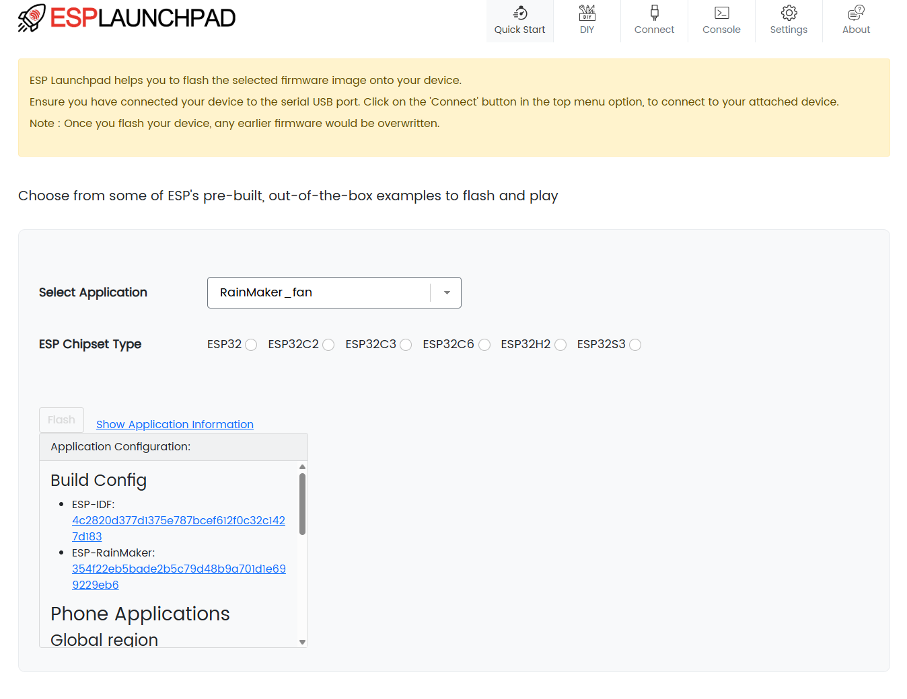
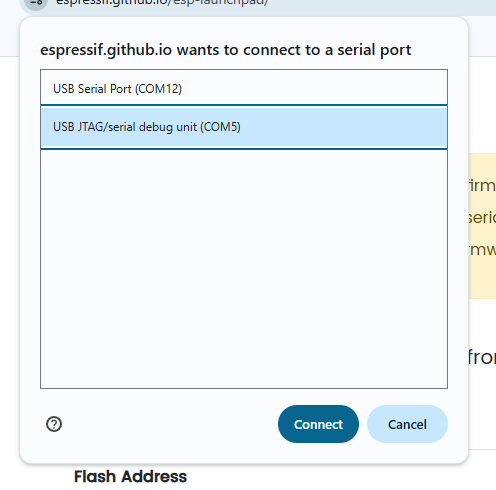
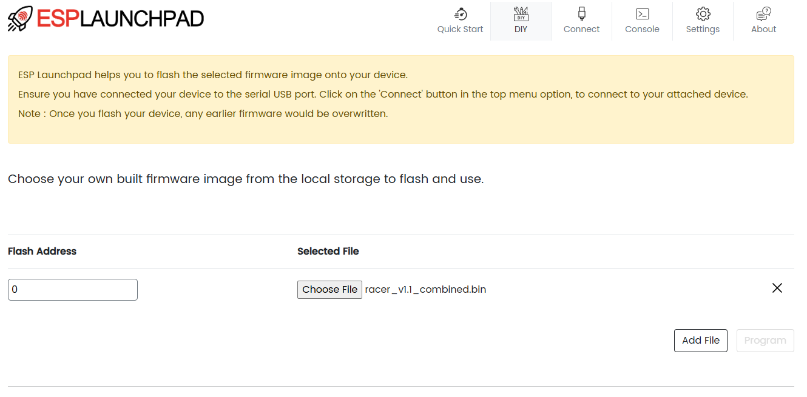
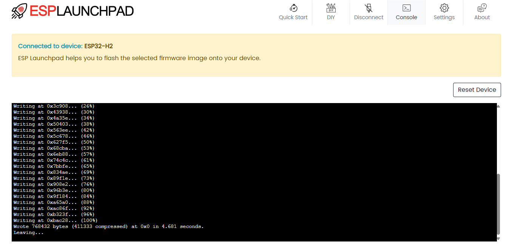

# Micro Racer Flashing Guide (ESP Launchpad)

## Navigation
- [Home](README.md) | [Quick Start](QuickStart.md) | [Micro Racer Assembly](RacerAssembly.md) | [Thumbtroller Assembly](ThumbtrollerAssembly.md) | [Flashing Guide](FlashingGuide.md)

---

This guide walks you through flashing your Micro Racer firmware using Espressif's web-based ESP Launchpad. ESP Launchpad uses WebUSB, so you can flash directly from your browser without installing desktop tools. For Micro Racer, use the DIY mode with your provided firmware binary. Reference: [ESP Launchpad](https://espressif.github.io/esp-launchpad/).

## Prerequisites

- A Chromium-based browser with WebUSB support (Google Chrome, Microsoft Edge)
- Note: Safari and Firefox are not supported for WebUSB yet; use Chrome/Edge instead
- Supported OS: Windows, macOS, and Linux (Chrome/Chromium)
- USB-C cable to connect your Micro Racer
- Micro Racer powered ON with battery connected
- Latest Micro Racer firmware `.bin` file (for DIY mode) from [GitHub Releases](https://github.com/StuckAtPrototype/Racer/releases/tag/fw_v_1_1)

## Step-by-Step Flashing Process

### 1) Open ESP Launchpad

1. Navigate to `https://espressif.github.io/esp-launchpad/`.
2. Keep this tab open throughout the process.

### 2) Connect Your Micro Racer

1. Switch the car to ON and ensure the battery is connected.
2. Connect the USB-C cable to your PC and the Micro Racer.
3. In the Launchpad top menu, click "Connect" and select your device from the WebUSB prompt.
4. If you do not see a device:
   - Try flipping the USB-C connector or using a different cable/port
   - Unplug/replug the USB
   - Ensure another app/serial monitor is not using the device

   

### 3) DIY: Select and add Micro Racer firmware

1. In ESP Launchpad, open the DIY section (top menu selector)
2. Click "Add File" and select the Micro Racer firmware `.bin` you downloaded.
3. Set the Flash Address to `0x0`.
4. Verify the file path and address are listed in the table.

Note: The default flashing and console settings in ESP Launchpad work for Micro Racer; no changes needed.

### 4) Program the Device

1. Click "Program" to start flashing.
2. Monitor progress in the Console area; wait until you see a completion message.

### 5) Reset the Device

1. When flashing is completed, click the "Reset Device" button on the Console tab to reboot into the new firmware.
2. If needed, you can also toggle the Micro Racer power switch OFF and back ON.

## Troubleshooting

- Browser support: Use Chrome/Edge; Safari/Firefox currently do not support WebUSB
- No device in Connect dialog: Flip the USB-C plug, try another port/cable, close other serial apps
- Programming fails: Reconnect the device, ensure Flash Address is `0x0`, retry "Program"
- Console output garbled: Set Console Baudrate to 115200
- After success but no response: Use "Reset Device" in Launchpad or power-cycle the car
- Linux-specific: If the device does not appear, install appropriate udev rules to allow user access to the ESP USB device, then unplug/replug and try Connect again

## Success

After resetting, the Micro Racer will boot the new firmware. Disconnect the USB cable and enjoy your updated racer.

Reference: [ESP Launchpad](https://espressif.github.io/esp-launchpad/)
